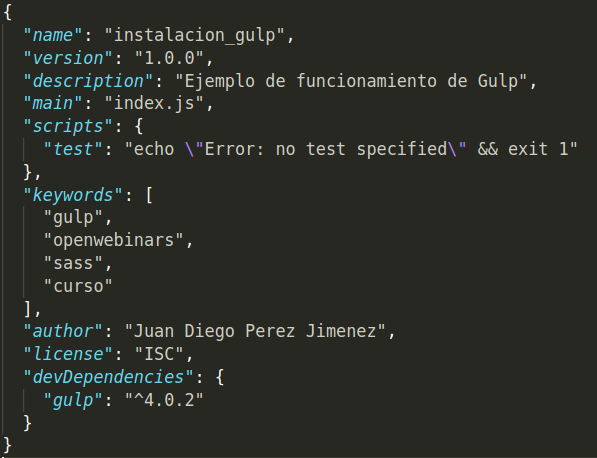

## Parte III.1 Instalación de Gulp.

Hemos acabado el capítulo anterior viendo cómo documentar mi proyecto Sass. Hemos visto que a la vez que desarrollamos el proyecto debemos documentarlo,por una serie de razones que ya hemos explicado.

Ahora, a mi entorno de trabajo voy a añadir un herramienta más, **Gulp**.Pero, **_¿qué es Gulp?_**.

**Gulp** es una herramienta que entra dentro de la categoría **_Build-Tool_** o **_Task-Runner_**. Nos va a permitir generar nuestra página web mediante la especificación de una serie de tareas que definiremos construyendo, de esta manera, nuestro **Workflow** de trabajo.

### Requisitos

Los requisitos para poder instalar **Gulp** son los mismos que para instalar **SassDoc**. Es decir:

- **Nodejs**: Entorno de ejecución para JavaScript.
- **Npm**: Gestor de paquetes para Node.
- **Npx**: Para poder ejecutar paquetes Node.

En el capítulo anterior ya vimos cómo hacerlo y cuál era la paǵina con los instaladores y la documentación necesaria para ello.

### Instalación

Una vez cumplidos con los requisitos instalar Gulp es tan sencillo como instalar un paquete node. Es decir:

```sh
## Si tengo los permisos adecuados
> npm install gulp -g

## Si tenemos que pedir permisos de superusuarios (Linux)
> sudo npm install gulp -g

```

Para comprobar que lo hemos instalado:

```sh

> gulp --version
CLI version: 2.2.0
```

### Crear un proyecto Gulp

Una vez tenemos Gulp instalado debemos de proceder,si es que estamos creando el proyecto desde cero, a crear el proyecto Gulp. Para ello desde la carpeta en la que estemos debemos ejecutar la siguiente orden:

```sh
> npm init
```

Esta orden me solicitará preguntas para la creación del fichero package.json dentro de esa carpeta.

Una vez hemos hecho esto debemos instalar Gulp localmente y hacer que el uso de Gulp se incluya en las dependencias de mi proyecto, lo que será necesario si queremos distribuir el mismo. Para ello:

```sh
> npm install gulp --save-dev
```

### El fichero package.json

El fichero **_package.json_**, que se crea al hacer _npm init_, es el manifiesto de nuestro proyecto y contiene toda la información del mismo así como las dependencias que pueda tener.

En el apartado anterior lo hemos creado, rellenando la información y añadiendo como dependencia **_Gulp_**. Tras hacer todo esto el contenido del mismo debería ser algo similar a lo siguiente:



Curso desarrollado por @pekechis para @openwebinars.
