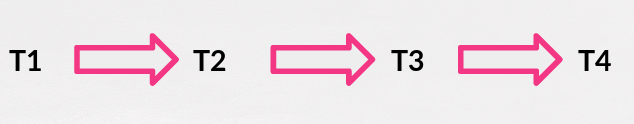
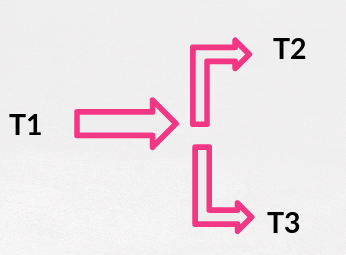

## Parte III.4 Workflow de Trabajo

Una vez nos hemos acercado, aunque sea muy por encima,  a las posibilidades que nos presenta Gulp vamos a definir cuál será nuestro "pequeño" flujo de trabajo como desarrolladores Front-End. 

Pero antes de proseguir vamos recordar lo que era un ***workflow*** o *flujo de trabajo*.

>  Un ***workflow*** es una serie de pasos que conforman nuestro proceso de  trabajo. En este caso nuestro trabajo como desarrollador FrontEnd.

En este capítulo lo definiremos  y posteriormente, en el capítulo 5, lo usaremos en el apartado para el desarrollo de nuestro propio FrameWork CSS.

Tenemos que tener en cuenta que en este workflow, una vez estemos en una empresa, habrá más tareas que quedan fuera del alcance de este curso. Tareas como testing, creación de contenedores (si es que nuestra empresa los uso) y despliegues más complejos que el que vamos a proponer que es un despliegue tradicional mediante SSH / SFTP.

Una vez dicho esto la lista de tareas que deberemos hacer con Gulp es la siguiente:

1. **Generar** las hojas de estilos a partir de los ficheros .scss.
2. **Generar** la documentación de nuestro framework a partir de los comentarios en los ficheros .scss.
3.  **Mover** todos los ficheros, incluidos los ficheros .html a la carpeta destino.
4.  **Borrar** los contenidos de las carpetas destino antes de la generación de los hojas de estilos y de los documentos y de mover los ficheros
5.  **Subir** la carpeta destino al servidor ya que mediante sFTP o mediante SSH.

### Tareas en Serie / Tareas en Paralelo

Debemos recordar también que Gulp podemos definir flujos en serie y flujos en paralelo.

Mediante los flujos en serie expresamos un orden de ejecución de tal manera que cuando un tarea acaba la siguiente dentro del flujo empieza. 

Si embargo en los flujos en paralelo, en un momento dado de nuestro flujo de trabajo dos tareas se empiezan a realizar a la vez. 

### Una visión global

Una vez dicho esto, el flujo de trabajo que os propongo es éste, aunque podéis adaptarlo según vuestras propias necesidades.

* Empezaremos borrando los contenidos de la carpeta destino.
* Generaremos las hojas de estilos y la documentación en paralelo.
* Moveremos lo generado a la carpeta destino.
* Una vez finalizado todo esto lo subiremos a nuestro servidor.

Curso desarrollado por @pekechis para @openwebinars.
