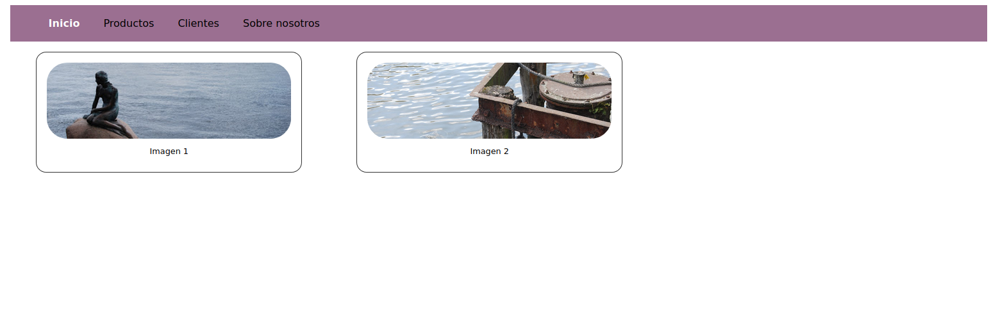

## Parte II.5 Ejercicio práctico.

En este apartado vamos a realizar un pequeño ejercicio para poner en práctica lo aprendido hasta ahora. Tendremos que realizar lo siguiente:

* Usar los comentarios para describir nuestras reglas CSS.
* Una paleta de colores para distintos elementos de nuestra web.
* Estilos generales para el contenedor principal y los bordes de mis elementos.
* Incluir estructuras de anidamiento para crear estilos para un menú y una figura.


Aunque hemos explicado de manera previa los conceptos de lIstas, mapas e interpolaciones no los vamos a usar en este ejemplo si no que veremos cómo se usan de manera real cuando hablemos de estructuras de control. Tienen más sentido su uso junto a ese tipo de estructuras.

El objetivo es conseguir el siguiente resultado:



### Paleta de colores

```scss
// Paletas de colores básica

//Colores generales
$color-background: #FFFFFF;
$color-base: #333333;


//Colores barra de menú
$navbar-background-color: rgb(155, 111, 145);
$navbar-color-hover: $color-background;

//Colores del borde 
$border-color: $color-base;

```

### Estilos generales para ciertos elementos

```scss
/*Estilos para el contenedor general de mi página*/
$main-container-width: 80%;

.container {
    width: $main-container-width;
    margin: 0 auto;
}


//Estilos para los bordes
$border-width: 0.1rem;
$border-style: "solid";

$border-radius-small: 0.2rem;
$border-radius: 1rem;
$boder-radius-big: 2rem;
```

### Estructuras de anidamiento


```scss
//Usando anidamiento crear la hoja de estilos para un menú 
nav {
    background-color: $color-navbar-background;
    padding: 0.2rem;

    ul {
        li {
            display: inline-block;
            padding-left: 1rem;
            padding-right: 1rem;

            &.active {
                color: $color-navbar-color-hover;
                font-weight: bolder;
            }

            &:hover {
                color: $color-navbar-color-hover;
            }


            a {
                text-decoration: none;
            }

        }
    }
}
```

```scss
/*Estructura de anidamiento para la figura (cards)*/
$figure-width: 25%;

figure.card {
    border: $border-width $border-style $border-color;
    border-radius: $border-radius;
    display: inline-block;
    padding: 1rem;
    
    width: $figure-width;
     img {
        border-radius: $boder-radius-big; 
        width: 100%;
     }

     figcaption {
         font-size: 0.8rem;
         margin: 0.5rem;
         text-align: center;
     }

}
```


Curso desarrollado por @pekechis para @openwebinars
