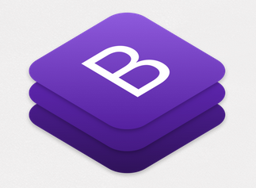
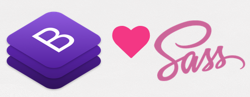

## Parte IV.1 Descargando BootStrap



Una vez nos hemos introducido en capítulos anteriores en el mundo de **Sass** y **Gulp** vamos a ver ahora cómo usar estas tecnologías para modificar **BootStrap** a nuestro gusto.

Pero, **¿qué es BootStrap?**.

**BootStrap** es un framework CSS desarrollado por la empresa Twitter que nos proporciona componentes web y que nos permite desarrollar páginas web responsivas de una forma rápida y sencilla.

Y, **¿por qué hemos elegido BootStrap para este curso?**.

Existen más alternativas pero hay tres razones de mucho peso (al menos desde mi punto de vista) que justifican esta elección:

- Es **fácil** de usar.
- Está muy **\*bien documentado** y tiene una comunidad muy activa que lo soporta.
- Y la razón de más peso en relación con este curso, **USA SASS** para generar y mantener la hoja de estilos final.



Pero no todo es maravilloso, para mí el **principal inconveniente** de usar **BootStrap** es que la página que voy a obtener es **IGUAL** de apariencia a otras muchas que usan esta librería.

Sin embargo, al estar hecha con Sass va a ser mucho más fácil modificar esta apariencia y adaptar BootStrap a mis propias necesidades y gustos.

### Descargando BootStrap

Para empezar a trabajar con **BootStrap** debemos clonar el repositorio que se encuentra en la siguiente [dirección](https://github.com/twbs/bootstrap).

Para clonarlo usaremos git:

```sh

> git clone https://github.com/twbs/bootstrap.git

```

Curso desarrollado por @pekechis para @openwebinars
