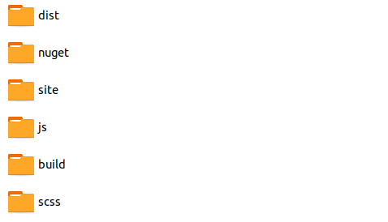

## Parte IV.2 Comprendienco la organización de BootStrap

Una vez nos hemos descargado BootStrap y antes de empezar a modificarlo para crear nuestro propio tema debemos comprender varias cosas:

* La estructura de directorios del repositorio que nos acabamos de bajar.
* El contenido del fichero package.json.
* El contenido y estructura de la carpeta Scss.

### Estructura de directorios

A nivel general la estructura del repositorio se puede apreciar en la siguiente imagen:

Destacan, para nuestro objetivos, las siguientes carpetas:

* La carpeta **SCSS** que contiene todos los ficheros *Sass* para construir las hojas de estilos asociados al Framework ***BootStrap***.
* La carpeta **JS** que contiene todos los archivos javascript asociados al comportamiento de los componentes que nos proporciona BootStrap (alertas, cuadros de diálogo, menú,galería de imágenes etc..)
* La carpeta **DIST** que es la carpeta destino, la carpeta donde se colocan todas las hojas de estilos y los archivos javascript una vez se ha realizado el proceso de "build", el proceso de construcción.

Menos importante para nosotros, al menos para este curso son:

* La carpeta **SITE** que contiene la página de BootStrap que está desarrollado con [Hugo](https://gohugo.io) un framework para la generación de sitios web estáticos.
* La carpeta **BUILD** que contiene los scripts del proceso de Build que de forma nativa se hace con Script npm, aunque **nosotros usaremos Gulp** 
* La carpeta **NUGET** que contiene la información relativa a *BootStrap* para la herramienta de Microsoft para la gestión de paquetes  .Net [Nuget](https://www.nuget.org/). 

### El fichero package.json

Es, como ya hemos dicho en capítulos anteriores, el fichero que se crea cuando trabajo con paquetes Node y contiene todo lo relativo a:

* Las dependencias necesarias para construir tanto BootStrap como su documentació.
* Los scripts para todas las tareas de ese proceso.

### El directorio Scss

Para nosotros, en este curso, es el directorio más importante ya que es el que contiene toda la información para la construcción de las hojas de estilos asociadas a **BootStrap**, tanto para todos aquellos aspectos relativos a la maquetación como para aquellos aspectos relacionados con la apariencia de los elementos.

El punto de partido es el fichero **bootstrap.scss** que contiene todo lo necesario, aunque hay versiones más limitadas como **bootstrap-grid.scss** , **bootstrap-reboot.scss** y **bootstrap-utilities.scss**.

En este fichero se añaden todos los elementos mediante el uso de la directiva Sass ***@import***.

Curso desarrollado por @pekechis para @openwebinars
