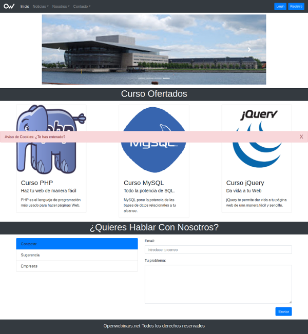
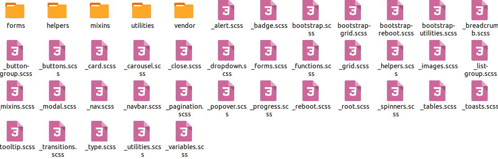

## Parte IV.3 Creando mi tema BootStrap I

Una vez nos hemos descargado BootStrap vamos a comenzar a modificar el tema por defecto poco a poco.El objetivo es que nuestra página sea diferente a las demás páginas que usan BootStrap y con ese objetivo vamos a dividir los contenidos de este apartado en los siguientes puntos:

1. Proyecto de Base
2. Elementos a modificar.
3. Localización de los ficheros a modificar.
4. Objetivo final.

### Proyecto Base

Para poder comprobar que estamos modificando el tema **BootStrap** correctamente vamos a ver los efectos de las hojas de estilos generadas en una página de ejemplo que tendrá la siguiente apariencia inicial con el tema BootStrap por defecto.

### Elementos a modificar

BootStrap 4, que es la versión que vamos a usar, es un FrameWork Css muy completo que nos proporciona un montón de utilidades, componentes y que nos hace muy fácil realizar páginas web responsivas.

No pretendo modificar todos los aspectos del mismo y sobre todo no quiero tocar los archivos que me permiten gestionar las responsividad. Voy a limitarme a los componentes y aspectos que están en la web que es mi base. 

Por lo tanto voy a modificar el tema por defecto en los siguientes aspectos:

1. **Body** (el color de fondo de la página).
2. El tipo de **letra**.
3. La apariencia del **menú** (componente navbar).
4. La apariencia de las **listas desplegables** (componente dropdown).
5. La apariencia de los **formularios**.
6. La apariencia del **carrusel de imágenes**.
7. La apariencia de las **tarjetas** (componente card).
8. La apariencia de los elementos en **pestañas** (componente tab).
9. La apariencia de los componentes **list-group**.
10. La apariencia de los **cuadros modales** (componente modal).
11. La apariencia de las **alertas** (componente alert).

Como es mucho trabajo en este apartado vamos a cubrir la modificación del tema por defecto para los 5 primeros y en el siguiente apartado veremos los demás.

### Localización de los ficheros a modificar

Los ficheros a modificar son los ***archivos .scss*** que están en la carpeta ***scss*** del repositorio **BootStrap** que me he descargado en el apartado anterior.

**BootStrap** está muy bien organizado y sólo fijándonos en el nombre podemos saber qué estilos contiene cada uno de los ficheros ***.scss**.

### Objetivo Final

Mi objetivo final, una vez modificados todos los ficheros .scss necesarios es obtener la siguiente web:

Curso desarrollado por @pekechis para @openwebinars
